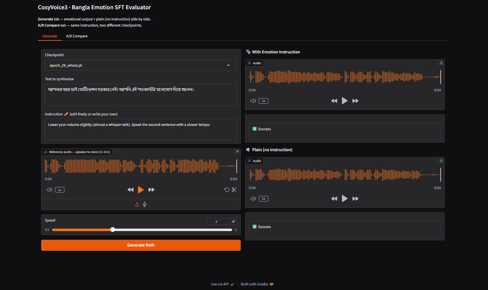

# CosyVoice3 Bengali Emotion TTS — Fine-tuning Pipeline

> **Fine-tuning [Fun-CosyVoice3-0.5B](https://github.com/FunAudioLLM/CosyVoice) on a custom Bengali podcast dataset with emotion and persona instruction control.**

---

## Overview

This repository documents a complete end-to-end pipeline for fine-tuning a multilingual TTS model on **Bengali (Bangla)** speech with **emotion-controlled synthesis**. The model learns to follow natural language instructions like *"speak calmly"*, *"speak as a journalist with a confident tone"* — and produce expressive Bengali speech accordingly.

**No code or dataset is shared in this repository.** This is a documentation-only showcase of the work done.

---

## What Was Built

| Component | Description |
|-----------|-------------|
| **Data Source** | 14 Bengali YouTube podcast videos (~30 speakers) |
| **Enrichment** | Gemini 2.5 Flash API — emotion, persona, quality scoring per segment |
| **Verification** | bengaliAI/Tugstugi (Whisper-medium) for dual ASR cross-check |
| **Quality Filtering** | EDA pipeline with 6 quality dimensions |
| **Training Format** | Kaldi-style → Parquet shards for torch DDP |
| **Base Model** | Fun-CosyVoice3-0.5B (LLM component SFT only) |
| **Training** | 30 epochs, 26,032 steps, Adam optimizer, fp32 |
| **Inference UI** | Gradio app with checkpoint selector + A/B compare |

---

## Pipeline Architecture

```
┌─────────────────────────────────────────────────────────────────┐
│                    DATA COLLECTION STAGE                         │
│                                                                  │
│  YouTube (14 Bengali Podcasts)                                  │
│       │                                                          │
│       ▼  speaker diarization + segmentation                     │
│  Raw Dataset: 4,253 WAV files @ 24kHz  [1.5 GB]                │
└─────────────────────────┬───────────────────────────────────────┘
                          │
┌─────────────────────────▼───────────────────────────────────────┐
│                   ENRICHMENT STAGE                               │
│                                                                  │
│  ┌─────────────────────────────┐                                │
│  │  Gemini 2.5 Flash API       │  per WAV file:                 │
│  │  • Bengali transcript       │  → Bengali transcript          │
│  │  • Emotion (65 labels)      │  → Primary/secondary emotion   │
│  │  • Persona (37 labels)      │  → Character persona           │
│  │  • Speech instruction       │  → Natural language descriptor │
│  │  • Quality scores (0–100)   │  → Noise, overlap, interrupt   │
│  └─────────────────────────────┘                                │
│                                                                  │
│  ┌─────────────────────────────┐                                │
│  │  Tugstugi ASR               │  cross-verification:           │
│  │  bengaliAI/Whisper-medium   │  → 2nd transcript              │
│  │                             │  → mismatch detection          │
│  └─────────────────────────────┘                                │
└─────────────────────────┬───────────────────────────────────────┘
                          │
┌─────────────────────────▼───────────────────────────────────────┐
│                  QUALITY FILTERING STAGE                         │
│                                                                  │
│  master_json.py  →  EDA across 6 quality dimensions             │
│                     • Audio quality (0–100)                     │
│                     • Noise confidence (0–100)                  │
│                     • Overlapping confidence (0–100)            │
│                     • Interruption score (0–100)                │
│                     • Multi-speaker detection                   │
│                     • Text analysis (pure Bangla vs anomalies)  │
│                                                                  │
│  final_data.py   →  Strict filters:                             │
│                     • Duration: 3–15 seconds                    │
│                     • Overlap score: ≤ 20                       │
│                     • Interruption score: ≤ 20                  │
│                     • Single speaker only                       │
│                     • Pure Bengali text only                    │
│                                                                  │
│  4,253 files  →  2,619 gold samples  (38.4% rejected)           │
└─────────────────────────┬───────────────────────────────────────┘
                          │
┌─────────────────────────▼───────────────────────────────────────┐
│                  FORMAT CONVERSION STAGE                         │
│                                                                  │
│  kaldi_style.py  →  Kaldi format:                               │
│    wav.scp                 
│    text         
│    utt2spk                      │
│                                                                  │
│  CosyVoice tools  →  speaker embeddings + speech tokens         │
│  webdataset        →  Parquet shards for DDP training           │
└─────────────────────────┬───────────────────────────────────────┘
                          │
┌─────────────────────────▼───────────────────────────────────────┐
│                     TRAINING STAGE                               │
│                                                                  │
│  Base:     Fun-CosyVoice3-0.5B  (LLM component only)           │
│  Engine:   PyTorch DDP (torch_ddp)                              │
│  Dtype:    fp32                                                  │
│  Epochs:   30  (26,032 total steps)                             │
│  LR:       1e-4  (constant + 100 warmup steps)                  │
│  Save:     every 500 steps + end of epoch                       │
│                                                                  │
│  Final: loss=0.1067  accuracy=97.23%                            │
└─────────────────────────┬───────────────────────────────────────┘
                          │
┌─────────────────────────▼───────────────────────────────────────┐
│                    INFERENCE STAGE                               │
│                                                                  │
│  Gradio App (port)                                         │
│  • Tab 1: Generate — emotional vs neutral side-by-side          │
│  • Tab 2: A/B Compare — two checkpoints, same instruction       │
│  • Checkpoint selection (160+ checkpoints)                      │
│  • Reference audio for speaker cloning                          │
│  • Speed control (0.5× – 2.0×)                                  │
└─────────────────────────────────────────────────────────────────┘
```

---

## Gradio Inference UI



---

## Sample Audio

| File | Description |
|------|-------------|
| [Reference_Audio.wav](reference_audio/Reference_Audio.wav) | Reference speaker audio used for voice cloning |
| [Output_Emotional.wav](reference_audio/Output_Emotional.wav) | Sample output — emotion-controlled Bengali synthesis |

---

## Dataset Statistics

### Raw Dataset (4,253 files)

| Metric | Value |
|--------|-------|
| Source videos | 14 Bengali YouTube podcasts |
| Total speakers | ~30 unique speakers |
| Total audio | ~7.8 hours |
| Sample rate | 24,000 Hz |
| Male | 2,863 (67.3%) |
| Female | 1,301 (30.6%) |
| High audio quality (≥80) | 4,234 (99.6%) |
| Pure Bengali text | 2,383 (56%) |
| Contains digits | 999 (23.5%) |
| Contains English | 870 (20.5%) |

### Gold Training Dataset (2,619 files — after filtering)

| Metric | Value |
|--------|-------|
| Total samples | 2,619 |
| Total duration | **4.12 hours** |
| Duration range | 3 – 15 seconds |
| Male | 1,771 (67.6%) |
| Female | 848 (32.4%) |
| Multi-speaker | 0 (all single speaker) |
| Overlapping speech | 0 |
| Interruptions | 0 |
| High audio quality | 2,609 (99.6%) |
| Avg instruction length | 24.5 words |

### Rejection Summary

| Rejection Reason | Files Removed |
|-----------------|---------------|
| Overlapping / interruption / multi-speaker | 581 |
| Duration outside 3–15s | 288 |
| Contains digits or English text | ~865 |
| **Total rejected** | **1,634 (38.4%)** |

### Top Emotions in Training Data

| Rank | Emotion | Count |
|------|---------|-------|
| 1 | calm | 716 |
| 2 | serious | 636 |
| 3 | objective | 499 |
| 4 | confident | 220 |
| 5 | curious | 180 |

### Top Personas in Training Data

| Rank | Persona | Count |
|------|---------|-------|
| 1 | content_creator | 929 |
| 2 | intellectual | 701 |
| 3 | host | 454 |
| 4 | journalist | 120 |
| 5 | businessman | 62 |

---

## Training Results

| Parameter | Value |
|-----------|-------|
| Base model | Fun-CosyVoice3-0.5B |
| Fine-tuned component | LLM (language model head only) |
| Training engine | PyTorch DDP (torch_ddp) |
| Data type | fp32 |
| Optimizer | Adam |
| Learning rate | 1e-4 (constant) |
| Warmup steps | 100 |
| Total epochs | 30 |
| Total steps | 26,032 |
| Save interval | every 500 steps + epoch end |
| Total checkpoints | 160+ |
| **Final loss** | **0.1067** |
| **Final accuracy** | **97.23%** |
| Training completed | 06 April 2026, 08:15 |

---


## Supported Emotions (43 mapped)

`calm` · `serious` · `objective` · `confident` · `introspective` · `curious` · `insightful` · `wise` · `surprised` · `fearful` · `conflicted` · `charming` · `sad` · `happy` · `determined` · `hopeful` · `relaxed` · `energetic` · `responsible` · `proud` · `frustrated` · `authoritative` · `disciplined` · `angry` · `commanding` · `motivated` · `dedicated` · `cheerful` · `contempt` · `disgusted` · `optimistic` · `intelligent` · `compassionate` · `empathetic` · `grateful` · `hesitation` · `indifferent` · `anxious` · `patient` · `ambitious` · `passionate` · `humble` · `enthusiastic`

## Supported Personas (37)

`host` · `co-host` · `actor` · `actress` · `politician` · `sportsman` · `athlete` · `journalist` · `reporter` · `doctor` · `physician` · `psychiatrist` · `psychologist` · `intellectual` · `scholar` · `philosopher` · `businessman` · `entrepreneur` · `activist` · `social_worker` · `legal_expert` · `lawyer` · `engineer` · `scientist` · `artist` · `musician` · `author` · `writer` · `filmmaker` · `content_creator` · `influencer` · `religious_leader` · `teacher` · `professor` · `student` · `youth`

---

## Repository Structure

```
cosyvoice3-bengali-emotion-tts/
│
├── README.md                          ← You are here
├── LICENSE
├── .gitignore
│
├── docs/
│   ├── 01_project_overview.md         ← Motivation and background
│   ├── 02_data_collection.md          ← YouTube → WAV pipeline
│   ├── 03_gemini_enrichment.md        ← Gemini API metadata extraction
│   ├── 04_asr_verification.md         ← Tugstugi dual-ASR verification
│   ├── 05_quality_filtering.md        ← EDA + quality filtering logic
│   ├── 06_training_format.md          ← Kaldi + Parquet format details
│   ├── 07_training_results.md         ← Loss curves, metrics, analysis
│   └── 08_inference_ui.md             ← Gradio app walkthrough
│
├── configs/
│   └── training_config.yaml           ← Sanitized training configuration
│
├── reference_audio/
│   ├── Reference_Audio.wav            ← Sample reference audio (speaker cloning input)
│   └── Output_Emotional.wav           ← Sample emotional output
│
└── results/
    ├── Gradio_App.png                 ← Gradio UI screenshot
    ├── eda_summary.md                 ← Full EDA report summary
    └── training_metrics.md            ← Per-epoch metrics
```

---

## References

- [FunAudioLLM/CosyVoice](https://github.com/FunAudioLLM/CosyVoice) — Base TTS model
- [Fun-CosyVoice3-0.5B on HuggingFace](https://huggingface.co/FunAudioLLM/CosyVoice3-0.5B)
- [bengaliAI/Tugstugi](https://huggingface.co/bengaliAI/tugstugi_bengaliai-regional-asr_whisper-medium) — Bengali ASR
- [Google Gemini 2.5 Flash](https://ai.google.dev/gemini-api/docs) — Audio analysis API
- [CosyVoice3 Technical Report](https://arxiv.org/abs/2407.05407)

---

## Author

**Simanta Saha** — ML Engineer, Bengali TTS Research  
Built with curiosity, late nights, and a lot of Bengali podcasts.

---

> This project is a personal research initiative. Dataset and model weights are not publicly available.
